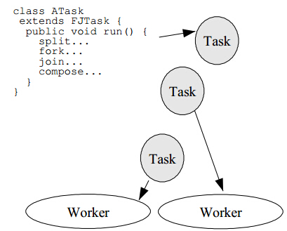
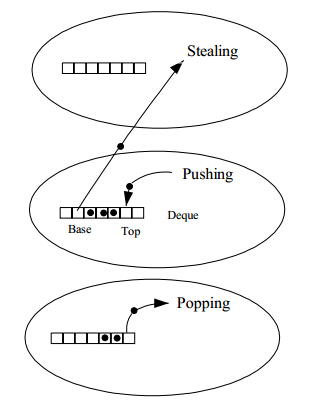

java fork/join框架（译）
========================

:时间: 2018-03-14

.. note::

   项目中用到的CompletableFuture异步编程较多，欲研究一下其中的原理，了解到其底层使用的是java7中的fork/join框架，巧又觅得大师(Doug Lea)的文章[ `A Java Fork/Join Framework <http://gee.cs.oswego.edu/dl/papers/fj.pdf>`__ ]，翻译一下前面部分内容。

摘要
----

这篇文章描述了一种支持并行编程风格的java框架的设计、实现和性能，通过递归将其划分为能够并行处理的子任务，等待计算并组装结果，这种框架的设计是基于Cilk work-stealing框架的一个变体，主要的实现技术是围绕着任务队列和工作线程构建效率和管理展开的。性能测评结果展示：相对于绝大多数程序有较好的并行速度,但也有一些可能需要改进。

1. 介绍
--------

fork/Join并行性关注最简单、最有效的设计技术以获取良好的并行性能，fork/Join算法是熟知的分治算法的并行版本，其典型形式:

.. code-block:: java

	Result solve (Problem problem) {
		if (problem is small) 
		   directly solve problem
		else {
			split problem into independent parts
			fork new subtasks to solve each part 
			join all subtasks
			compose result from subresults
		}

fork操作启动一个新的并行fork/join子任务，join任务使得当前任务在被fork的子任务计算完成后方能继续。和fork/join算法其它的分治算法类似，也几乎采用递归，重复划分子任务小到能够使用简单直接的串行方法来处理它们。

《Concurrent Programming in Java》第二版一些相关的程序设计技术和示例将在第4.4小结进行讨论。第2、3、4节分别讨论FJTask的设计、实现以及性能，这是一个支持java框架并行风格的框架。FJTask可以通过[ `网址 http://gee.cs.oswego.edu <http://gee.cs.oswego.edu>`__ ] 下的util.concurrent包获取到。

2. 设计
-------

fork/join程序可以使用支持并行构造子任务以及有等待完成的机制的任意框架来运行。然而，java.lang.Thread类(和POSIX的pthreads线程一样，Java线程常基于它)并非是支持fork/join编程的最优的工具：

- fork/join任务有简单、常规的同步和管理要求。计算图表表明，fork/join任务运行的调度策略相比于通用线程更高效。比如，fork/join任务除非是在等待子任务，否则永远不会阻塞。因此，普通线程在追踪阻塞线程时的开销和记录是一种浪费。
- 合理的基本任务粒度，构造和管理一个线程的开销可能比任务本身的计算时间更久，尽管粒度你能够也应该随着运行的特殊平台进行调整，粗粒度加重了线程的开销，将限制采用并行处理的可能机会。

简而言之，标准线程框架针大多数的fork/join程序来说太笨重了，但是线程做为并发和并行编程风格的基础，不太可能（或至少不切实际）去移除现有开销或调整线程自身的调度来支持这种(fork/join)风格。这个问题有一定的历史了，但Cilk第一次的发布提供了一个系统性的解决这些问题的框架。Cilk和其它轻量级运行框架支持用于在操作系统基础线程或执行机制之上的fork/join。这个策略同样适用于java。创建这样一个轻量级的Java执行框架能以更简便的方式编写fork/join程序并能广泛运行在支持JVM的操作系统上。

FJTask框架是基于Cilk设计方案的一个变体。另外的变体见Hood, Filaments, stackthreads以及相关的基于轻量级可执行任务。

2.1 工作窃取(Work-Stealing)
^^^^^^^^^^^^^^^^^^^^^^^^^^^

fork/join的核心在于其自身的轻量级调度机制。FJTask采用了Cilk提出的最基本策略：工作窃取：

- 各工作线程维护自身调度队列中可执行的任务。
- 队列以双端队列方式进行维护，支持LIFO的push和pop操作以及FIFO的take操作。
- 在由给的的工作线程运行的任务生成的子任务push到自身的deque中。
- 工作线程以LIFO的顺序处理自身队列中的任务。
- 当一个工作线程没有本地任务可以运行时，尝试随机选择一个工作线程并以FIFO的规则窃取对应线程的任务。
- 当工作线程遇到join操作时，它会处理其他可用任务直到目标任务完成（通过isDone方法）。所有任务以非阻塞方式完成运行。
- 当工作线程无工作且无法从其它工作线程窃取到任务时，将会返回（通过yields, sleeps, 或调整优先级，见章节3）然后再次进行尝试，直到其他工作线程都处于限制状态，这时所有的工作线程将被阻塞起来直到其它任务从top端被调用。

[5]中讨论了更多的细节，各线程使用LIFO规则处理自身的任务，但通过FIFO规则去窃取其他任务对于广泛的递归fork/join设计是最理想的。换而言之，这种模式提供了两个基本的优势：

窃取工作线程在双端队列的另一端操作能减少同原工作线程的竞争。同时，它还利用了分而治之的递归算法产生早期较大的任务。因此，老的窃取任务似乎为工作线程获到更大的任务，这会通过窃取线程来进行进一步的递归划分。

作为这些规则的结果，采用相对更细粒度的任务比仅采用粗粒度或不采用递归分解的方法能够运行更快。虽然fork/join中少只有量任务被窃取，但创建细粒度的任务意味着当工作线程准备运行它时已经准备就绪。

3. 实现
--------

框架用约800行的纯Java代码实现，主要是FJTaskRunner类，是java.lang.Thread.FJTasks子类，维护布尔类型的完成状态变量以及将其他所有的操作交予当前工作线程完成。FJTaskRunnerGroup类用来构造工作线程，维护一些共享状态（如所有工作线程的认证、窃取操作）并协同开始和停止工作。更多实现细节文档可以通过util.concurrent包进行获取，本章节主要讨论在实现框架时遇到的两个问题和解决方案：支持高效的双端队列操作（push、pop和take操作），以及管理线程获取新工作的窃取协议。

3.1 双端队列(Deques)
^^^^^^^^^^^^^^^^^^^^^^^^^^^^^^^^^^^

为了能够高效且可伸缩的执行，任务管理必须尽可能快地完成，creating，pushing以及之后的poping(或者低频度的taking)任务类比于程序在顺序执行所产生的开销。较低的开销使程序员能够采用更小的任务粒度，从而更好地利用并行性。务是依靠JVM进行分配，Java的垃圾回收使得我们不必构造一块特殊用途的内存分配器来维护任务。与其他语言实现的类似框架相比，这大大减少了实现FJTasks的复杂度和代码量。

双端队列的主要挑战是同步和竞争。即使在使用优化的同步工具的jvm上，对每个push和pop操作获取锁的需求也成为了瓶颈。然而，Cilk采取了适配策略以提供基于如下的解决方法：

	- push和pop操作只能由线程本身调用。
	- 同对take操作操作一个可重入锁容易使得take操作与窃取线程冲突（双端队列锁在必要的时候可以禁用take操作）。因此，接口控制减少了量部分的同步问题。
	- pop和take只有在双端对别为空时才会产生干扰，否则就能够保证运行在元素不相交的数组中。

将top和base指针定义为volaile以保证pop和take操作在双端队列有多个个元素时无需锁定。这可以通过类似于Dekker的算法为top添加一个前减量：
 if （--top >= base） ...
以及为base添加一个前增量:
 if (++base < top) ...

在每种情况下，它们必须通过比较两个索引检测是否会导致双端队列变为空。一个用于定位潜在冲突的非对称规则：pop操作将会在获取到双端队列锁之后继续重新检测状态并尝试继续（take操作类似），在双端队列为空时返回。take操作将会立即回退，典型的，尝试从其他线程中进行窃取。这种非对称表示是J与Cilk语言THE协议实现的重要不同之处。

使用volatile索引让push操作仅在队列溢出时需要同步，这种情况下首要的就是获取双端队列锁并重新设置数组大小。此外，简单地保证了top在双端队列数组被填充后被修改降低take操作的干扰。

随后的初步实现，对个JVM和JMM(Java内存模型)规则对volatile字段要求的先写再读具有不一致性。作为一种解决方法，pop重新获取锁的操作被调整为如果有两个或更少的元素时触发，并为take操作添加另一把锁以保证内存屏障。只要大多数索引更改被所有者线程忽略，这就足够了(在阅读volatile字段时，哪些平台可以保持适当的内存顺序)，在性能上仅有一点点的下降。

3.2 窃取和空闲
^^^^^^^^^^^^^^^^^

work-stealing框架中的工作线程对其运行程序的同步要求一无所知。它们简单的generate, push, pop, take，管理状态和执行任务。这个模式的简单性使得当所有线程即使有大量的工作时也能高效地执行。然而，当没有足够工作时，这种流水线就会产生以启发式为代价。在启动一个主任务期间，在其完成之后，以及在一些fork/join算法中使用的全局完全停止同步点。

这儿一个主要问题就是当工作线程无本地任务且不能从其他线程处窃取一个任务时会做什么处理.如果成行运行在专用处理器上，可以使用忙则等待的方式循环尝试窃取工作。然而，意图窃取会增加竞争，这会使得这些线程降低速度甚至闲置（因为章节3.1中的锁协议）。此外，在这个框架更典型的应用中，操作系统将以某种方式尝试运行其他不相干的进程或线程。

用Java实现这个框架工具很弱且没有保障，但在实际工作中是可接受的，一个线程如果不能从任何其他线程获得工作，则在尝试另外的窃取之前会降低它的优先级，调用Thread.yield方法，并在TJTaskRunnerGroup中将其注册为非活跃状态。如果所有的工作线程都变成非活状态时跃，它们将会阻塞并等待主任务的同步。此外，在给定的自转次数后后，再次窃取任务前线程将进入睡眠阶段(约100ms)而不是调用yield方法，在程序中人为强加的休眠将花费大量的时间切分任务。但这似乎是解决通用问题的最佳办法。框架以后的版本可能支持额外的控制方法，可以让编程人员在遇到影响性能时能重载默认方法。
  