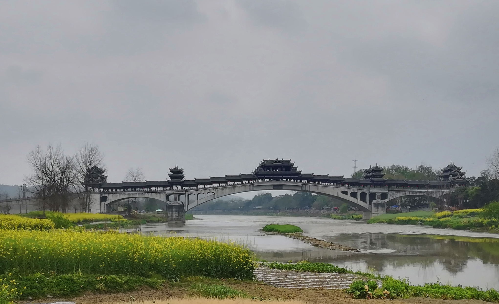

脚踏摩拜，直捣黄龙
=======================

:时间: 2018年3月18日

上周公司小陆约骑行去黄龙溪，但晚上去欢乐谷看了个灯光节，就没去成，周天还想去看看桃花节，碰碰桃花劫什么的，哈哈，后来事实证明，其实桃花就是花，看看拍几张留作又到此一游的念想，还是骑约40公里去黄龙溪来得酸爽。

约好的三人骑行还有公司另一同事小王，早儿，和小陆一起摩拜去五阶公司楼下和小王会合，一路上还是走了不少弯路，不得不赞一下高德地图导航，本来之前一直跟着导航指示走大路，有一不宽的拐弯段路指向人家的菜林子里面，这能通过？三人狐疑，最后还是跟着进去了，耶 还真是柳暗花明又一村，村里面藏一三米宽的水泥宽道。

骑行过程还是吃了不少苦头，尤其是路上有不少的小上斜坡路段，本来预计12点前到目的地，近1点了，才勉强到距离目的地1公里多的地方落脚吃饭，嗯，穷游穷开心，整个骑行过程比看黄龙溪景点更有意思，老夫体力还行。哈哈。

[ `摩拜80里 <https://pan.baidu.com/s/139gWY_Us8feLLmzsnnw2Jw>`__]

